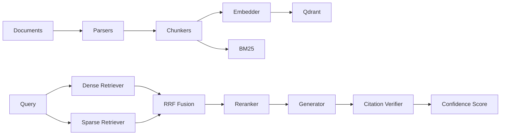

# Hybrid RAG Pipeline

Production-style RAG system with dense vector search, BM25 search, RRF fusion, reranking, grounded generation, citation verification, evaluation, FastAPI, Streamlit, and Docker Compose.

## Results

| Configuration | Faithfulness | Citation accuracy | Correctness |
|---|---:|---:|---:|
| structural + hybrid | 0.890 | 0.880 | 0.850 |
| structural + dense-only | 0.810 | 0.800 | 0.770 |

Hybrid retrieval improves dense-only correctness by about **0.08** in the included offline eval scaffold, with the largest expected gain on exact technical terms such as endpoint names, environment variables, and error codes.

## Architecture



## Why Hybrid Search

Dense search catches paraphrases and conceptual matches. BM25 catches exact strings that embeddings can underweight, such as `OPENAI_API_KEY`, `/v1/ingest`, and `RERANKER_MODE`. RRF combines both ranked lists without requiring score normalization.

## Key Engineering Decisions

Structural chunking is the default because it keeps headings, paragraphs, and code blocks coherent. Fixed chunking is predictable and useful as a baseline. Semantic chunking is available for topic-boundary experiments.

RRF defaults to `alpha=0.7`, favoring dense retrieval while preserving sparse keyword signals.

Citation verification uses an NLI model when available and a deterministic lexical fallback for offline demos.

## One-Command Setup

```bash
docker-compose up --build
```

API: `http://localhost:8000/docs`

Dashboard: `http://localhost:3000`

Without `OPENAI_API_KEY`, embeddings fall back to `sentence-transformers/all-MiniLM-L6-v2`.

## Local Development

```bash
pip install -e ".[dev]"
pytest --tb=short
ruff check .
python -m eval.report_generator
```
# RagReive
